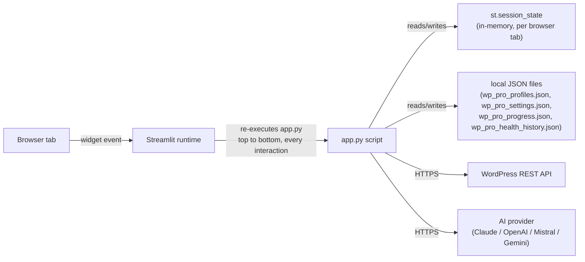
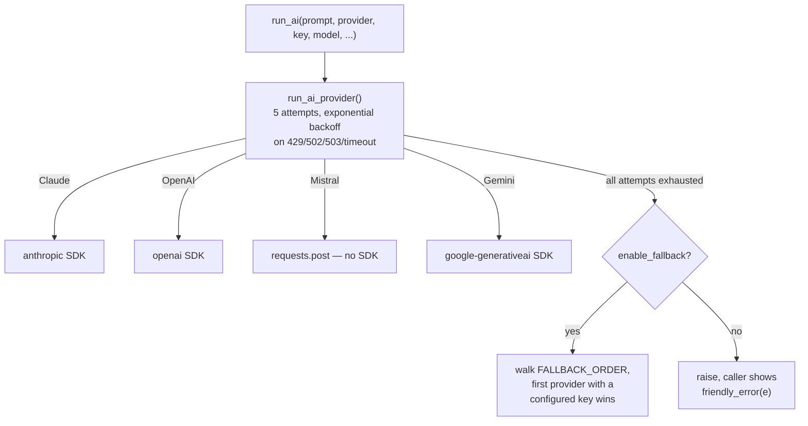
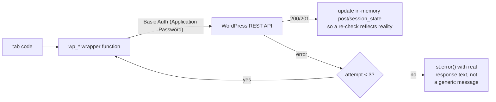
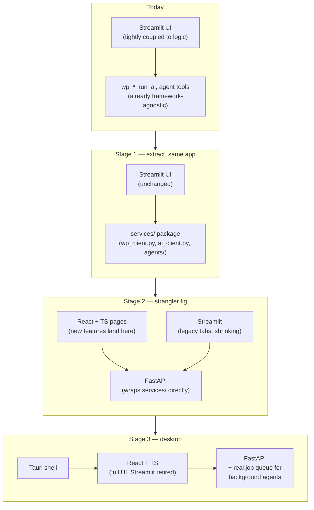
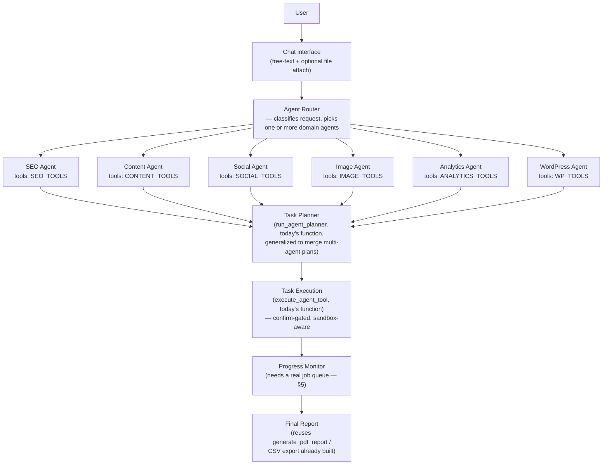

# WP Pro Ultra — Architecture Report & Roadmap

*Prepared as lead-architect review, per your brief: analyze before implementing, evolve don't replace.*

---

## 0. Read this first — the codebase has forked

Before anything else: **the project you uploaded (`v2.0` + Social) and the project actually running in this repo have diverged.** They share a common ancestor but neither is a superset of the other.

| | Uploaded zip (`v2.0 + social`) | This repo (`claude/wp-pro-ultra-agent-vpdvm8`) |
|---|---|---|
| Lines in `app.py` | 2,728 | 4,725 |
| Dashboard | Static stats dashboard | Conversational **Agent** tab with free-text tool-calling (plans real actions from a prompt, whitelisted tool registry, confirm-before-run) |
| Landing Pages tab | ✅ Present — builds static "shortcut" pages per post, zipped for static hosting | ❌ Missing |
| Social Posts tab | ✅ Present — X/Facebook caption generator, batch mode, CSV export | ❌ Missing |
| Theme & Design tab | ❌ Missing | ✅ Present — site identity, color/typography (Global Styles), media library manager, homepage ticker patterns, plus its own scoped **AI Command** box |
| Companion apps | None | Standalone native Android app (Kotlin/Compose) — separate codebase, same WP REST contract |

**My read:** this repo is the more advanced lineage everywhere except two tabs (Landing Pages, Social Posts), which exist *only* in your upload. Nothing in your upload is architecturally more advanced than this repo — it's an earlier snapshot that grew two features independently after forking.

**Recommendation:** treat this repo as canonical, port Landing Pages + Social Posts into it as new modules (they're clean, self-contained, low-risk to merge — see §5), and retire the uploaded lineage. I have not done this merge yet — flagging it here because it changes "what is the existing project" for the rest of this document, and you should confirm before I fold anything in.

---

## 1. Runtime model

Single-process Streamlit app. One Python file (`app.py`, 4,725 lines) run via `streamlit run app.py`; no server framework, no build step, no database. State lives in three places:

The consequence that matters most architecturally: **every click reruns the entire 4,725-line script.** Streamlit's model has no persistent server-side object graph between interactions — `st.session_state` is the only thing that survives a rerun, and every tab's rendering code, every helper-function definition, and the whole sidebar re-executes on every single button press, checkbox toggle, or text input blur. At the current file size this is already the dominant cost on tabs with heavy conditional rendering (Site Health's seven sub-tabs, Theme & Design's five sub-tabs); it will get worse, not better, as more agents/tools are added.

---

## 2. Feature inventory (this repo)

| Tab | What it does | Real WP writes? |
|---|---|---|
| 🤖 Agent | Greets by name/time, offers a full audit, action-chip menu, **plus a free-text command box** that plans steps from a whitelisted tool registry (`AGENT_TOOLS`) and executes only on confirmation | Yes, via the same tools as the dedicated tabs |
| 🩺 Site Health | 7 sub-tabs: Overview, Technical, Security, Performance (PageSpeed), SEO Crawl, Content Quality, Reports (PDF/CSV) | Yes — plugin installs, image-dimension fixes |
| 📡 Scan & select | Paginated post fetch, filter, search, bulk select | No (read-only) |
| 🔧 Optimize posts | AI rewrite, quality gate, resumable batch (crash-safe via `wp_pro_progress.json`) | Yes |
| 🖼️ Fix images | Generates + uploads featured images with alt text for posts missing one | Yes |
| ✨ Create posts | Multi-topic batch creation, SEO meta, schema.org JSON-LD, smart 24h scheduling | Yes |
| 🔍 SEO tools | Batch meta description + focus keyword → Yoast/RankMath fields | Yes |
| 🎨 Theme & Design | Site identity (title/tagline/logo/icon), color palette (Global Styles read + best-effort write + copy-paste snippet fallback), media library manager, homepage ticker pattern detection, **and its own scoped AI Command box** (`DESIGN_TOOLS` — deliberately narrower registry than the Agent tab's) | Yes |

Two planning/execution engines already exist and share code (`run_agent_planner(tools=...)` takes the registry as a parameter) — this is the seed of the multi-agent design discussed in §6.

---

## 3. AI integration layer

- One entry point (`run_ai`) for every text generation call in the app — no tab talks to a provider SDK directly.
- Optional SDKs (`anthropic`, `openai`, `google-generativeai`) are imported in `try/except ModuleNotFoundError` at module load — a missing package disables only that provider. Mistral needs no SDK (plain `requests`).
- Image generation is a **separate, un-unified pair** of functions (`gen_image_dalle`, `gen_image_pollinations`) called directly from six+ call sites rather than through one dispatcher the way text generation is. This is the one clear inconsistency in an otherwise well-factored AI layer — worth a `gen_image(provider, ...)` wrapper.
- **No caching, no token accounting, no request logging.** Every "regenerate" re-spends real API cost. For a product positioning itself as an "AI Operating System," cost visibility (tokens spent per action, per site) is a gap, not a nice-to-have.

---

## 4. WordPress REST integration layer

Every write goes through a small set of named wrappers (`wp_update_post`, `wp_create_post`, `wp_install_plugin`, `upload_wp_image`, `update_wp_settings`, `apply_global_styles_colors`, `toggle_homepage_pattern`, …) — this is the strongest part of the codebase. The pattern is consistent everywhere:

Auth is a single Basic-Auth header built once (`make_auth(user, pw)` → base64), reused everywhere — there is no OAuth, no token refresh, no per-site session object. For **multi-site** management (explicitly named in your dev philosophy), this is the layer that will need to become a proper `WordPressClient` class holding one authenticated session per connected site, instead of a `domain` string threaded through every function call.

**Known real limitation, already documented in-app rather than faked:** core WP REST has no endpoint for the `custom_logo` theme mod or for arbitrary `theme.json` writes. The app uploads real media and does a genuine read-modify-write of the Global Styles record where that endpoint exists, and falls back to a copy-paste snippet with instructions when it doesn't. This "real fix or honest instructions, never a fake button" rule is applied consistently across the whole codebase — it's a real design asset worth preserving through any rewrite.

---

## 5. "Background processing" — the part that needs the most honesty

There is no background processing in the conventional sense. What exists:

- **Crash-safe resumable batches**: `wp_pro_progress.json` checkpoints which post IDs have been processed, so a killed process can resume — but the batch loop itself is a synchronous `for` loop with `time.sleep(0.5)` between items, **blocking the Streamlit script thread for the loop's entire duration**. The browser tab shows a live progress bar because Streamlit streams partial output during that same blocked execution — it looks async, it isn't.
- No task queue, no worker process, no way to close the browser tab and have a batch keep running server-side.
- This is the single biggest gap between the current architecture and "AI Operating System" ambitions — anything resembling "kick off a 500-post SEO sweep and come back later" needs a real background worker (Celery/RQ/arq + Redis, or at minimum a `ThreadPoolExecutor`-backed job registered outside the Streamlit script lifecycle) — this is *not* obtainable inside Streamlit's execution model no matter how the code is organized, and is one of the strongest arguments for the framework question in §7.

---

## 6. Data models, config, caching — inventory

- **Data models**: none, by design so far — posts, media, and settings are passed around as the raw dicts the WordPress REST API returns. This has worked because every function that touches a post shape stays close to where it's used. It will not scale past ~2 more agent domains without normalized models (a `Post`, `Site`, `MediaItem` dataclass/pydantic layer) — right now, "what fields does a post dict have at this point in the code" is answerable only by reading the fetch call above it.
- **Config**: three tiers — sidebar widgets (per-session, `st.session_state`), a saved-profiles file (`wp_pro_profiles.json`, plaintext, explicitly documented as such), and a small cross-site settings file (`wp_pro_settings.json`, e.g. "your name"). No secrets manager, no encryption at rest — acceptable for a local single-user tool, a real gap if this ever becomes multi-user or hosted.
- **Caching**: effectively none. `st.session_state.design_media_cache` is the only example of caching a fetched result across reruns; everything else re-fetches from WordPress or re-calls the AI provider on every rerun that touches it. `st.cache_data`/`st.cache_resource` (Streamlit's own primitives for exactly this) are unused anywhere in the codebase — low-risk, high-value fix available today regardless of any larger migration.

---

## 7. The framework question — Streamlit vs. FastAPI + React + Tauri

You're right that Streamlit is approaching its ceiling, and your instinct on the replacement stack is the correct one *for where this product is trying to go*. But the two things worth being precise about before committing:

**Where Streamlit is already the wrong tool, structurally, not just cosmetically:**
- True background jobs (§5) — not obtainable inside Streamlit's execution model, full stop.
- Full-script rerun on every interaction — a floating chat overlay, live multi-site dashboards, or drag-and-drop workflow builders all fight this model rather than being served by it.
- Custom animation/layout — everything currently achieved is CSS injected into `st.markdown(unsafe_allow_html=True)`, which is how this app gets its polish today, and it's already near the ceiling of what that technique can do.

**Where a full rewrite would be the wrong call, given your own rules ("never break existing features," "reuse existing code"):**
- The AI integration layer (§3) and WordPress REST layer (§4) are already framework-agnostic Python — they don't import `streamlit` and can be lifted into a FastAPI service layer close to verbatim.
- A big-bang rewrite risks months of parity work before the new app does everything the current one does, during which you'd be maintaining two codebases or shipping neither.

**My recommendation as architect:** commit to the FastAPI + React + Tauri direction, but as a **staged extraction, not a rewrite**:

1. **Now (low-risk, do this regardless of the framework decision):** pull the WordPress and AI layers out of `app.py` into a `services/` package with zero Streamlit imports. This is pure refactor — same behavior, same UI, and it's the same work either way (it's also what makes multi-site management and the merged Social/Landing tabs cleaner immediately).
2. **Next:** stand up FastAPI as a thin wrapper around `services/`, running *alongside* the still-fully-functional Streamlit app. Build the first React page against it for whichever feature most needs what Streamlit can't do — almost certainly a real background job runner + live status panel, since that's the sharpest structural gap today.
3. **Then:** move tabs to React one at a time as they need Streamlit-incompatible features (floating chat, drag-and-drop workflows); leave simple form-heavy tabs (SEO tools, Site Identity) on Streamlit until there's an actual reason to move them — they cost nothing to leave alone.
4. **Last:** Tauri wraps the finished React frontend + FastAPI backend (as a managed sidecar process) once the React surface covers what a desktop user needs day-to-day.

This gets you the commercial-grade product you're describing without a rewrite window where nothing ships, and every step after step 1 is independently reversible if priorities change.

---

## 8. Proposed multi-agent architecture

Your diagram is the right shape, and it's not starting from zero — `AGENT_TOOLS` / `DESIGN_TOOLS` / `run_agent_planner(tools=...)` / `execute_agent_tool()` are already a working, tested instance of exactly this pattern at one-agent scale (§2). Scaling it to your diagram means promoting "a registry + a planner + an executor" from an ad-hoc pattern used twice to a first-class abstraction every domain agent implements the same way:

Every box on the right of "Agent Router" already exists in embryo:
- **Router** — new; today the user manually picks which tab's command box to use (Agent tab = general, Theme & Design's box = design-only). A router that reads intent and picks the registry is a natural generalization of the `tools=` parameter already on `run_agent_planner`.
- **Domain agents** — each is "a tool registry + the executor branches for it," which is precisely the `AGENT_TOOLS`/`DESIGN_TOOLS` split already in the code. An SEO Agent, Content Agent, Social Agent, Image Agent, WordPress Agent are mostly a matter of *sorting the existing 15+ tool functions into named registries* — not new capability.
- **Analytics Agent** is the one genuinely new domain (nothing today reads Google Analytics / Search Console) — real net-new work, not a refactor.
- **Task Planner / Execution** — exist today (`run_agent_planner`, `execute_agent_tool`), single-agent. Generalizing to multi-agent plans (a request that needs both the SEO Agent and the Image Agent) is an extension of the current JSON contract, not a rewrite of it.
- **Progress Monitor** — doesn't really exist yet (§5) — this is where the background-job gap and the framework migration intersect: a Progress Monitor worth having needs a real job runner, which is the same thing driving the FastAPI recommendation.

---

## 9. Recommended next steps (in order)

1. **Decide the fork** (§0) — confirm this repo is canonical and I port Landing Pages + Social Posts in, or tell me otherwise.
2. **Extract `services/`** (§7 step 1) — zero-risk, unblocks everything else, including the multi-site client work your dev philosophy calls for.
3. **Sort existing tools into named per-domain registries** (§8) — mechanical, low-risk, and is the actual first step toward the multi-agent diagram regardless of the frontend decision.
4. **Add a real job queue** for anything long-running — the highest-leverage single change for "feels like a commercial product," and a prerequisite for a genuine Progress Monitor.
5. Only after 2–4 are stable: start the FastAPI + React extraction for the first Streamlit-incompatible feature.

I've done the analysis; I haven't touched any code. Tell me which of the above to start on and I'll scope that piece properly before writing anything.
